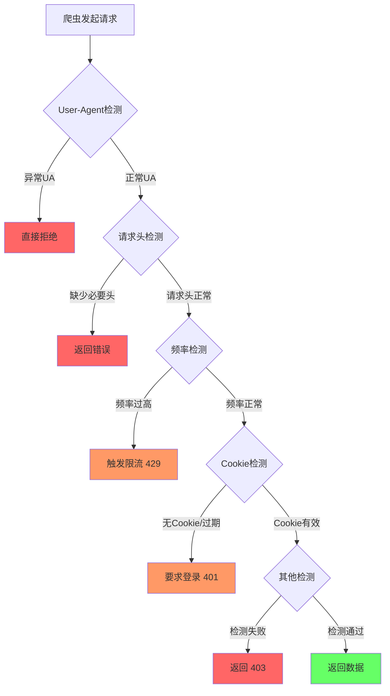

# 反爬虫基础对抗

理解目标站常见的反爬检测链路，是设计稳定爬虫的前提。本节梳理服务端从请求进入到放行/拦截的判定顺序，以及各环节的常见对抗手段。

## 核心思路

- **模拟真实浏览器**：UA、请求头、Cookie 与正常用户保持一致
- **控制访问节奏**：频率、并发、时段分布避免触发限流
- **维持会话状态**：登录态有效、Cookie 及时刷新
- **分层降级**：单点检测失败时针对性修复，而非盲目重试

---

## 服务端检测流程

目标站通常按由浅到深的顺序逐层校验，任一环节失败即中断请求。

---

## 检测项与应对

### User-Agent 检测

| 拦截表现 | 常见原因 | 应对策略 |
|----------|----------|----------|
| 直接拒绝 / 空响应 | UA 为空、含 `python-requests` 等特征 | 使用真实浏览器 UA 池轮换 |
| 返回验证码页 | UA 与请求行为不匹配 | UA 与 Headers / TLS 指纹保持一致 |

- 维护 UA 池，按站点维度绑定，避免同一 Cookie 频繁切换 UA
- 禁止在 UA 中暴露爬虫框架标识

### 请求头检测

| 拦截表现 | 常见原因 | 应对策略 |
|----------|----------|----------|
| 400 / 403 | 缺少 `Referer`、`Accept-Language` 等 | 从真实浏览器抓包补齐 Headers |
| 412 前置校验失败 | 缺少签名头、时间戳、Token | 逆向 JS 或使用浏览器环境生成 |

- 以浏览器 DevTools 抓包为基准，建立站点 Headers 模板
- 动态参数（sign、nonce）优先在 `client/` 层统一封装

### 频率检测

| 拦截表现 | 常见原因 | 应对策略 |
|----------|----------|----------|
| **429** 限流 | QPS 过高、同一 IP 请求过密 | 降速、指数退避、读取 `Retry-After` |
| IP 封禁 | 持续高频访问 | 代理池轮换、分时段调度 |

- 单域名设置 QPS 上限，全局 + 单任务双层限流
- 429 触发后下调并发，避免放大风控（参见《工程化爬虫开发规范》重试策略）

### Cookie 检测

| 拦截表现 | 常见原因 | 应对策略 |
|----------|----------|----------|
| **401** 要求登录 | 无 Cookie 或 Session 过期 | 走 `login/` 模块重新登录 |
| 登录后仍 401 | Cookie 域 / Path 不匹配 | 检查 Set-Cookie 写入与携带范围 |

- Cookie 与账号、代理 IP 绑定存储，避免串号
- 登录态失效时刷新 Token，勿用失效 Cookie 盲目重试

### 其他检测

| 拦截表现 | 常见原因 | 应对策略 |
|----------|----------|----------|
| **403** 禁止访问 | IP 黑名单、设备指纹、JS 挑战 | 切换 IP、Playwright 渲染、过验证码 |
| **412** 风控 | 行为异常、环境指纹不一致 | 降速 + 换环境 + 更新指纹参数 |

常见进阶手段包括：TLS 指纹、Canvas 指纹、WebDriver 检测、行为序列分析。基础对抗搞不定再升级到浏览器自动化或专用逆向。

---

## 对抗 Checklist

- [ ] UA 池：真实浏览器 UA，无框架特征
- [ ] Headers：Referer / Accept / Accept-Language 等与抓包一致
- [ ] 频率：单域 QPS 限制 + 429 退避
- [ ] Cookie：登录态维护、过期自动刷新
- [ ] 代理：IP 健康检查与轮换策略
- [ ] 监控：429 / 401 / 403 占比告警

---

## 与工程规范的关系

| 检测环节 | 对应 HTTP 状态 | 详见 |
|----------|----------------|------|
| 频率过高 | 429 | 工程化规范 · 重试策略 |
| Cookie 失效 | 401 / 403 | 工程化规范 · HTTP 错误码 |
| 风控 / 指纹 | 412 | 工程化规范 · 异常处理流程 |

建议将本节对抗策略落地到 `core/client.py`（Headers / 限流）与 `login/`（Cookie 维护），与项目目录结构保持一致。
