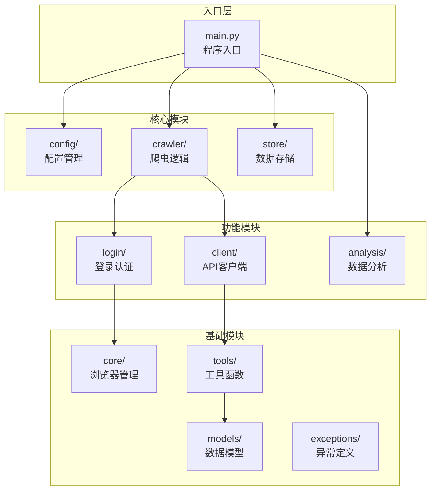
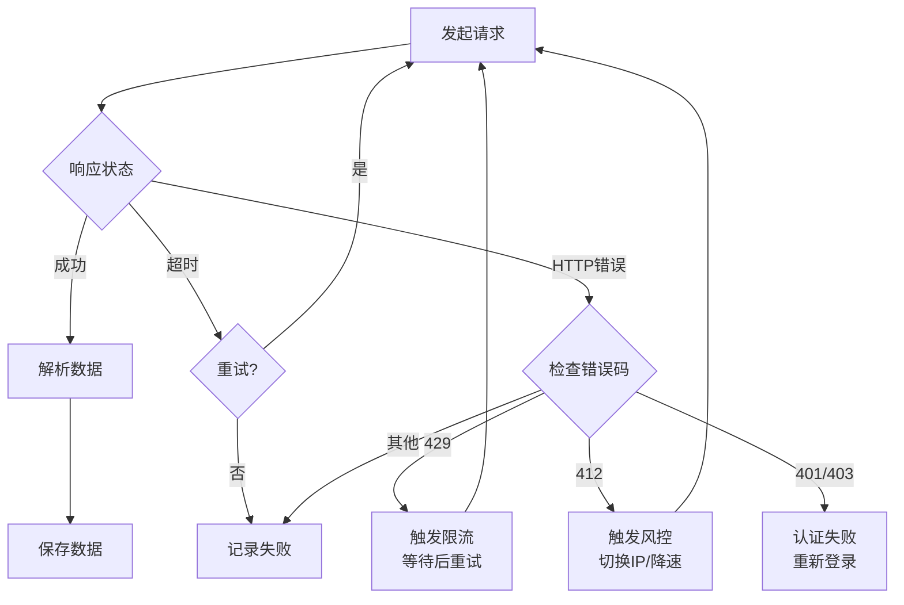

# 工程化爬虫开发规范

面向生产环境的爬虫工程约定，涵盖项目组织、请求链路、异常处理、数据存储与上线运维。目标是在高并发、反爬与不稳定网络下，仍保持可观测、可恢复、可维护的数据采集流程。

## 核心原则

- **请求可追踪**：每次请求携带 trace id，失败必须落库或写日志
- **失败可分类**：按 HTTP 状态与业务错误码分支处理，禁止一律重试
- **重试有上限**：指数退避 + 最大次数，避免放大风控
- **数据幂等**：保存层支持去重键，防止重试造成脏数据

---

## 项目组织

### 模块架构

模块按职责分层：入口层统一调度，核心模块承载采集与存储主链路，功能模块提供登录与 API 能力，基础模块沉淀可复用能力。



| 分层 | 模块 | 职责 |
|------|------|------|
| 入口层 | `main.py` | 解析参数、加载配置、启动爬虫任务 |
| 核心模块 | `config/` | 环境变量、站点配置、运行参数 |
| 核心模块 | `crawler/` | 页面抓取、任务编排、调度入口 |
| 核心模块 | `store/` | 数据持久化、去重写入、导出 |
| 功能模块 | `login/` | 登录态维护、Cookie / Token 刷新 |
| 功能模块 | `client/` | HTTP / API 请求封装 |
| 功能模块 | `analysis/` | 采集结果统计、报表与离线分析 |
| 基础模块 | `core/` | 浏览器 / 会话管理、资源池 |
| 基础模块 | `tools/` | 通用工具、格式化、加解密 |
| 基础模块 | `models/` | 数据结构、Pydantic 模型 |
| 基础模块 | `exceptions/` | 统一异常类型与错误码 |

### 标准目录

推荐按「配置 → 核心 → 解析 → 存储 → 模型 → 工具」组织代码，入口与运行产物（日志、数据）与源码分离。

```
my_crawler/
├── config/                 # 配置模块
│   ├── __init__.py
│   └── settings.py         # 配置定义
├── core/                   # 核心模块
│   ├── __init__.py
│   ├── client.py           # HTTP 客户端封装
│   └── retry.py            # 重试策略
├── crawler/                # 爬虫模块
│   ├── __init__.py
│   ├── base.py             # 爬虫基类
│   └── xxx_crawler.py      # 具体爬虫实现
├── parser/                 # 解析模块
│   ├── __init__.py
│   └── xxx_parser.py       # 页面解析器
├── store/                  # 存储模块
│   ├── __init__.py
│   ├── base.py             # 存储基类
│   ├── mysql.py            # MySQL 存储
│   └── json_store.py       # JSON 文件存储
├── models/                 # 数据模型
│   ├── __init__.py
│   └── xxx_model.py        # Pydantic 模型定义
├── exceptions/             # 异常定义
│   ├── __init__.py
│   └── crawler_exceptions.py
├── utils/                  # 工具函数
│   ├── __init__.py
│   └── helpers.py
├── logs/                   # 日志目录
├── data/                   # 数据输出目录
├── tests/                  # 测试目录
│   └── test_xxx.py
├── .env                    # 环境变量（不提交到 git）
├── .env.example            # 环境变量示例
├── .gitignore
├── requirements.txt        # 依赖列表
├── main.py                 # 程序入口
└── README.md               # 项目说明
```

**目录约定**

- `crawler/` 只负责调度与抓取，解析逻辑下沉到 `parser/`
- `store/` 通过基类抽象 MySQL、JSON 等多种后端，便于切换与测试
- `core/retry.py` 实现下文「重试策略」，与异常处理流程配合
- `logs/`、`data/` 不纳入版本控制，仅保留目录占位或 `.gitkeep`

---

## 请求与异常处理

### 处理流程



### 成功路径

1. 校验 HTTP 2xx 与业务 `code`
2. 解析 HTML / JSON / 二进制流（`parser/` 模块）
3. 字段清洗、类型转换、空值兜底
4. 写入存储层并更新任务状态

### 超时

| 场景 | 建议 |
|------|------|
| 连接超时 | 立即重试 1～2 次，间隔 1s |
| 读超时 | 降并发后重试，记录慢站点 |
| 连续超时 | 标记域名降级，切换备用入口 |

### HTTP 错误码

| 错误码 | 含义 | 处理策略 |
|--------|------|----------|
| **429** | 限流 | 读取 `Retry-After`，等待后重试；全局 QPS 下调 |
| **412** | 风控 / 前置校验失败 | 切换代理 IP、降低频率、更新 Cookie / 指纹 |
| **401 / 403** | 认证或权限失败 | 刷新 Token / 重新登录，勿盲目重试 |
| **5xx** | 服务端错误 | 有限次重试 + 指数退避 |
| **其他 4xx** | 客户端或规则问题 | 记录样本请求，人工排查后修正规则 |

### 重试策略

`core/retry.py` 建议按以下参数实现：

```
max_retries: 3
backoff: exponential (base=2s, max=60s)
retry_on: [timeout, 429, 502, 503, 504]
no_retry_on: [401, 403, 404, 412]
```

- 同一 URL 在窗口期内失败超过阈值，进入熔断
- 重试必须带 jitter，避免齐刷刷打爆目标站
- 达到上限后写入死信队列，供人工或离线补偿

---

## 数据存储

与架构图中 `store/` 模块对应，采集成功后的落库规范如下：

- 原始响应与解析结果分离存储，便于回放与排错
- 使用 `(source, item_id, crawl_date)` 作为幂等键，配合核心原则中的「数据幂等」
- 大批量写入优先走批量 upsert，控制事务粒度
- 存储实现继承 `store/base.py`，按需扩展 MySQL、JSON 等后端

---

## 运维与接入

### 工程化 Checklist

- [ ] 请求前：Headers / Cookie / UA 池轮换策略
- [ ] 请求中：超时、并发、代理健康检查
- [ ] 请求后：指标上报（成功率、延迟、重试次数）
- [ ] 告警：429/412 占比突增、连续失败率超阈
- [ ] 合规：robots.txt、频率限制、数据脱敏

### 开始接入

1. 按「标准目录」初始化项目骨架，配置 `config/settings.py`
2. 实现 `core/client.py` 与 `core/retry.py`，封装请求与异常分支逻辑
3. 在 `crawler/` 注册具体 Spider，对接 `parser/` 与 `store/`
4. 配置监控大盘与失败样本采集，小流量灰度 → 全量放量
