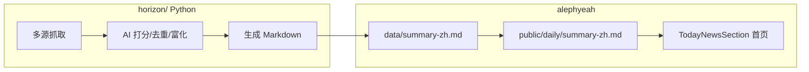

# Horizon 抓取日报

> **上游项目**：[NanmiCoder/Horizon](https://github.com/NanmiCoder/Horizon) — AI 驱动的多源信息聚合，生成 Markdown 日报。

本项目已将 Horizon 完整 pipeline 拷贝至 `horizon/` 目录，并与首页「今日资讯」展示链路打通。

---

## 架构



**抓取源**（可在 `horizon/data/config.json` 配置）：GitHub、Hacker News、RSS、Reddit、Telegram、Twitter、GDELT、Google News 等。

---

## 首次配置

```bash
# 1. 安装 uv（Python 包管理器）
curl -LsSf https://astral.sh/uv/install.sh | sh

# 2. 复制配置模板
cp horizon/data/config.example.json horizon/data/config.json
cp horizon/.env.example horizon/.env

# 3. 编辑 horizon/.env，填入至少一个 AI API Key
#    ANTHROPIC_API_KEY / OPENAI_API_KEY / DEEPSEEK_API_KEY 等

# 4. 安装 Python 依赖
cd horizon && uv sync && cd ..
```

可选：运行交互式配置向导 `cd horizon && uv run horizon-wizard`。

---

## 抓取命令

| 命令 | 说明 |
|------|------|
| `pnpm crawl:daily` | 运行 Horizon pipeline → 同步到 `data/` 与 `public/daily/` |
| `pnpm crawl:daily:sync` | 跳过抓取，仅同步已有 `horizon/data/summaries/` 最新中文日报 |
| `pnpm sync:daily` | 将 `data/summary-zh.md` 复制到 `public/daily/`（构建时自动执行） |

环境变量：

- `HORIZON_HOURS=48` — 抓取最近 48 小时内容
- `HORIZON_SKIP_CRAWL=1` — 仅同步，不运行 pipeline

---

## 输出格式

Horizon 生成 `horizon/data/summaries/horizon-YYYY-MM-DD-zh.md`，脚本自动复制为 `data/summary-zh.md`。

首页 `TodayNewsSection` 通过 `fetch('/daily/summary-zh.md')` 加载，由 `src/lib/daily-summary.ts` 解析条目与元数据。

---

## 目录结构

```
horizon/
├── src/
│   ├── main.py              # CLI 入口
│   ├── orchestrator.py      # 编排：抓取 → AI → 日报
│   ├── scrapers/            # 各数据源抓取器
│   ├── ai/                  # 打分、富化、Markdown 渲染
│   └── storage/manager.py   # 配置与日报存储
├── data/
│   ├── config.example.json
│   └── summaries/           # 生成的日报（gitignore）
└── pyproject.toml
```

---

## 注意事项

- 抓取需有效的 AI API Key，首次运行可能耗时数分钟
- `horizon/.env` 与 `horizon/data/config.json` 已加入 `.gitignore`，勿提交密钥
- Cloudflare Pages 为静态部署，**生产环境需在 CI 或本地 prebuild 前执行 `pnpm crawl:daily`**
