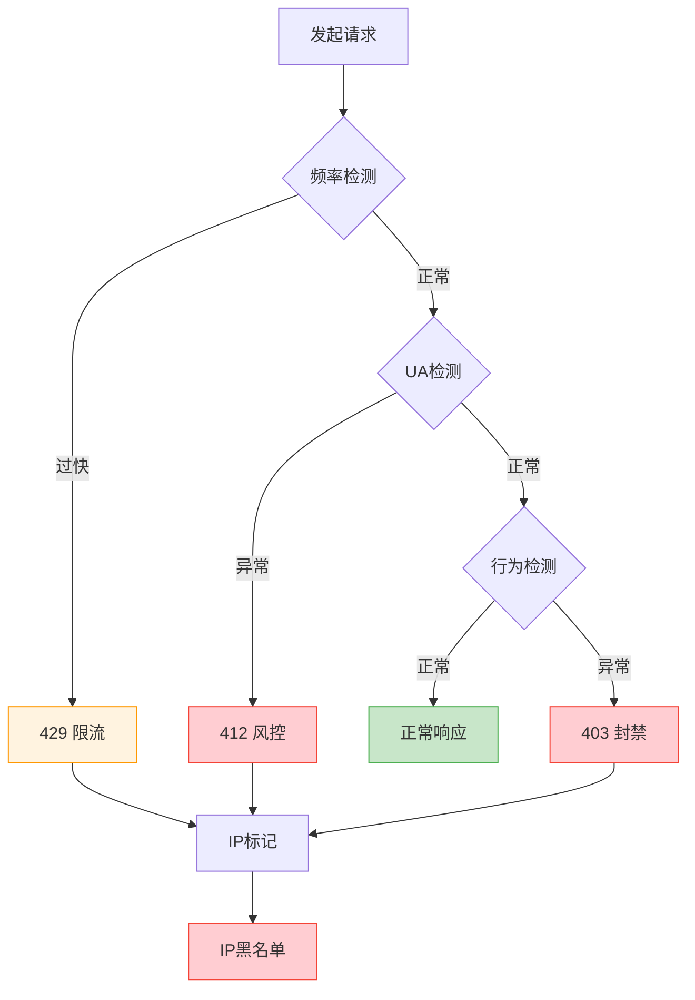

## 代理封禁机制

当爬虫通过代理发送请求时，目标网站的防护系统会经过多层检测来判断是否为爬虫流量。每一层检测失败都会导致不同的封禁策略，最终将 IP 加入黑名单。

### 检测流程

### 三层检测机制

| 检测层 | 触发条件 | 响应码 | 含义 |
|--------|---------|--------|------|
| **频率检测** | 请求频率超过阈值 | `429 Too Many Requests` | 临时限流，降低频率后自动恢复 |
| **UA 检测** | User-Agent 缺失、异常或为已知爬虫标识 | `412 Precondition Failed` | 风控拦截，请求被拒绝 |
| **行为检测** | 访问模式异常（如固定间隔、无 Referer、无 Cookie） | `403 Forbidden` | IP 封禁，需更换代理 IP |

### 封禁升级路径

1. **429 限流** → 首次警告，通常持续数分钟到一小时。服务端记录该 IP 的请求频率。
2. **412 风控** → 进一步确认该 IP 存在异常行为特征，标记为可疑。
3. **403 封禁** → 最终判定为爬虫流量，IP 被加入黑名单。解封时间从数小时到永久不等。

一旦 IP 进入黑名单，该代理将无法再访问目标网站的任何资源。因此，在爬虫开发中，及时识别这些响应码并切换代理至关重要。
